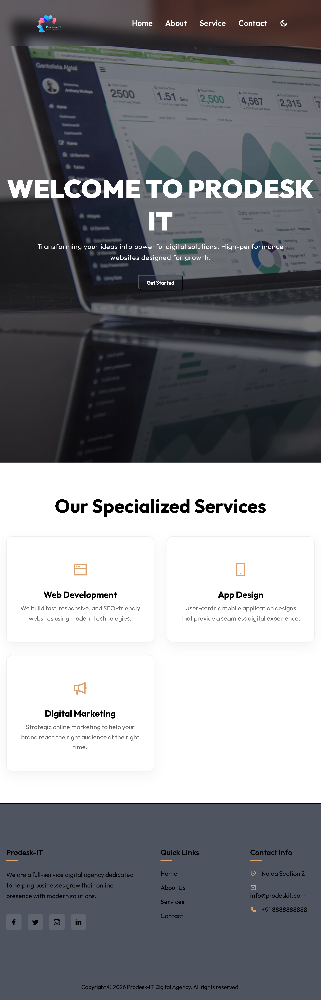

## 📸 Preview

## 📺 Project Demo

# Prodesk-IT Digital Agency Website
A responsive multi-level landing page built with raw HTML, CSS, and JS.

## Features
- Dark/Light Mode Toggle 
- Sticky Navbar with scroll effects
- Mobile Side-Drawer Menu
- Service Cards with micro-interactions

## Tech Stack
- HTML5, CSS3 (Flexbox/Grid), Vanilla JavaScript
- **Icons Source:** [Remix Icon Pack](https://remixicon.com/) v4.8.0 via global CDN endpoints.

## 🚀 Live Demo 
- **Live Demo:** [Click Here to View Live](https://prodesk-it-trainee-1.vercel.app/)
